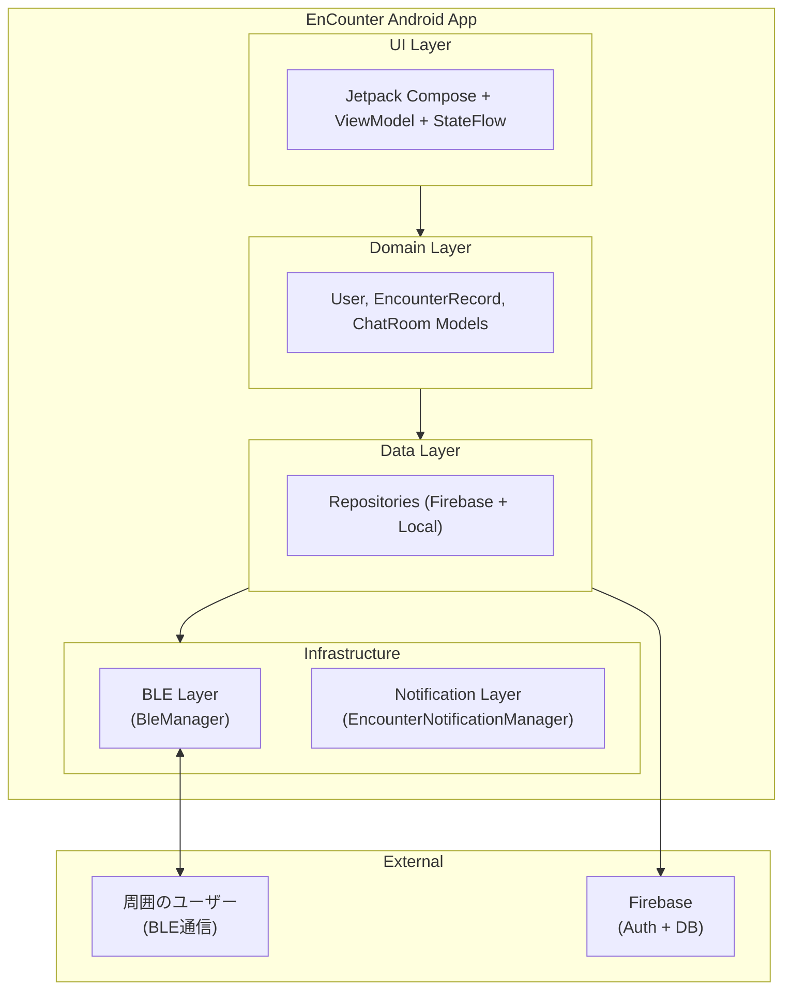
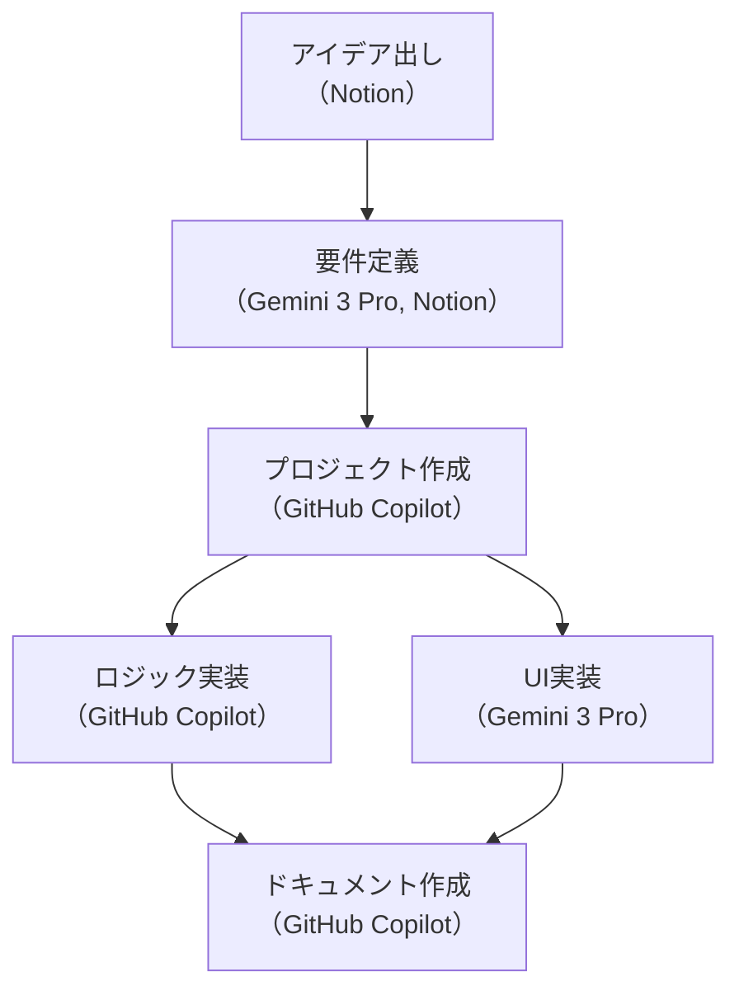
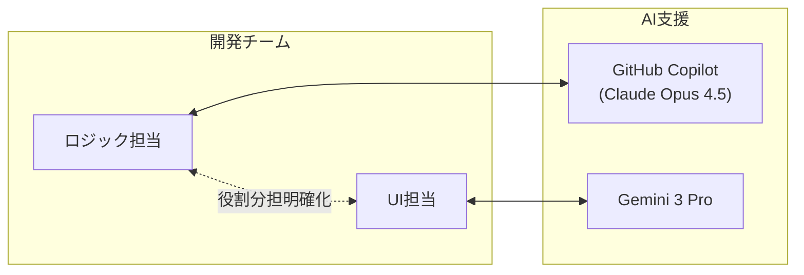

# EnCounter - ハイパーローカル・すれちがいマッチングアプリ

  
  
  
  
  
  **「その場所、その瞬間、その気分」を共有する、一期一会のデジタルすれちがい通信**

  

  ---

  ### クイックリンク
  
  

---

## 目次

- [目次](#目次)
- [製品概要](#製品概要)
  - [背景（製品開発のきっかけ・課題など）](#背景製品開発のきっかけ課題など)
  - [製品説明](#製品説明)
  - [システム構成](#システム構成)
  - [特長](#特長)
  - [解決出来ること](#解決出来ること)
  - [活用シーン](#活用シーン)
  - [今後の展望](#今後の展望)
- [技術仕様書](#技術仕様書)
  - [Version 1.0.0](#version-100)
  - [計画中](#計画中)
- [開発技術](#開発技術)
  - [活用した技術](#活用した技術)
  - [独自技術](#独自技術)
- [開発過程（生成AIの活用について）](#開発過程生成aiの活用について)
  - [開発プロセス全体図](#開発プロセス全体図)
  - [開発ドキュメント](#開発ドキュメント)
  - [各フェーズでのAI活用](#各フェーズでのai活用)
  - [開発体制](#開発体制)
  - [AI活用の設計思想](#ai活用の設計思想)
- [更新履歴](#更新履歴)

---

## 製品概要

### 背景（製品開発のきっかけ・課題など）

本プロジェクトは、「**群衆の中の孤独**」を解消することを目的としています。

#### **解決すべき3つの課題**

1. **群衆の中の孤独**  
満員電車や街中に人は溢れているのに、誰とも繋がっておらず孤独を感じる。

2. **SNS疲れ**  
世界中と繋がるSNSは、常に見られている感覚や、ログが残る重圧がある。

3. **機会損失**  
隣に座っている人が、実は自分と同じマイナーな趣味の同志かもしれないのに、それを知る術がない。

### 製品説明

#### **EnCounter** - 名前に込めた想い

> **En**（縁 / えん）+ **Counter**（遭遇・出会い）= **EnCounter**
> 
> 偶然のすれちがいから生まれる「縁」と、リアルな「遭遇」を繋ぐアプリケーションです。

---

> **BLE × 条件マッチング：スマホが「すれちがい」を検知**

**EnCounter**は、スマートフォンのBLE（Bluetooth Low Energy）機能を活用し、半径数メートル以内の「すれ違った誰か」の気配を可視化します。

**今の気分（Mood）や興味（Tags）が合致した時だけ**繋がることができる、ハイパーローカル・マッチングアプリです。

**主要機能：**
- **BLEすれちがい検知**: リアルタイムに周囲のEnCounterユーザーを検知
- **条件付きマッチング**: ステータス（気分）と興味タグが一致した場合のみ通知
- **ステルスモード**: 自分を見せずに他者を検知するモード
- **すれちがい図鑑**: 過去のすれちがい履歴を保存・閲覧
- **チャット機能**: マッチしたユーザーとリアルタイムチャット

### システム構成

| コンポーネント         | 技術スタック              | 役割                                 |
| :--------------------- | :------------------------ | :----------------------------------- |
| **Androidアプリ**      | Kotlin + Jetpack Compose  | UI・BLE通信・ビジネスロジック        |
| **認証・データベース** | Firebase Auth + Firestore | ユーザー認証・プロフィール・チャット |
| **BLE通信**            | Android BLE API           | すれちがい検知（Advertise/Scan）     |
| **ローカル永続化**     | SharedPreferences         | 設定・履歴保存                       |

**アーキテクチャ概要：**

### 特長

#### 1. **条件付きマッチング - 「同じ気分」の人だけ**
単に近くにいる人を表示するのではなく、**ステータス（気分）と興味タグが一致した人だけ**を通知。「暇してます」同士、「ゲーム仲間募集」同士など、今の気分が合った人と繋がれます。

#### 2. **プライバシー重視の設計**
- **匿名認証**: メールアドレス不要、ニックネームのみ
- **ステルスモード**: 自分を見せずに周囲を確認可能
- **BLE通信**: 位置情報サービス不要（Android 12以降）
- **一期一会**: チャットログは保存されるが、その場を離れれば関係は終了

#### 3. **バッテリー効率を考慮したBLE通信**
- **Low Latencyモード**で高速検知しつつ、フィルタリング処理でバッテリー消費を最小化
- **送信電力・受信感度の調整**で検知距離をカスタマイズ可能

#### 4. **ポケットの中の体験**
画面を見ていなくても、マッチする人とすれ違ったら「**ブルッ**」と振動で通知。鼓動風のバイブレーションパターンで、さりげなくお知らせします。

### 解決出来ること

- **偶然の出会いを演出**: 検索では見つからない、物理的な偶然が生む出会い
- **気づきの機会を提供**: 隣に座っている同じ趣味の人を可視化
- **匿名で安全なコミュニケーション**: 住所も本名も不要、アバターとしての付き合い
- **SNS疲れからの解放**: その場限りの一期一会、ログに縛られない軽い繋がり

### 活用シーン

#### 「同じ場所、同じ想い」を共有する一期一会

同じ目的で同じ場所にいるのに、誰とも繋がれずに孤独を感じる──**EnCounter**は、そんな瞬間を一期一会の出会いに変えます。

**こんな時に：**

1. **聖地巡礼での偶然の出会い**  
   好きなアニメ・マンガの聖地に来たのに、一人で写真を撮るだけ。でも実は、すぐ隣にも同じ作品のファンがいるかもしれません。「聖地巡礼中」のステータスと作品タグが一致すれば、その瞬間に繋がれます。

2. **ライブ後の余韻を共有**  
   ライブが終わった後の高揚感、誰かと語り合いたいけど知り合いはもう帰った──。EnCounterなら、会場周辺で同じアーティストのタグを持つ人と「まだ興奮冷めやらぬ」気持ちを共有できます。

3. **満員電車での共感**  
   毎日の通勤ラッシュで疲れていても、周りは皆スマホを見ているだけ。「疲れた」ステータス同士なら、ちょっとした愚痴や励まし合いで、少しだけ気持ちが軽くなるかもしれません。

**その他の活用例：**
- **カフェでの作業仲間探し**：「カフェで作業中」×「プログラミング」タグで同業者と出会う
- **旅先での情報交換**：「旅行中」×「観光」タグで現地のおすすめスポットを教え合う
- **イベント会場での友達作り**：コミケ・技術カンファレンス・スポーツ観戦など、同じ興味を持つ人と自然に繋がる

### 今後の展望

#### より精度の高いマッチング
- **自然言語入力による興味・目的の登録**
  - キーワードタグではなく、文章で興味や目的を自由に表現
  - AI による類似度判定で、言葉は違っても同じ趣味の人を検出
- **イベント連動マッチング**
  - 位置情報と自然言語入力から API でイベントを自動推測
  - 「ライブ会場」「カンファレンス」などの文脈に応じたマッチング
- **AI学習とレコメンデーション**
  - 過去のマッチング履歴から好みを学習
  - 「この人と話が合いそう」のサジェスト機能

#### UX・エンゲージメント向上
- **RSSI可視化（距離表示）**
  - 相手との物理的な距離をビジュアル表示
  - 「近づいてる」「遠ざかってる」をリアルタイム通知
- **いいね・スタンプ機能**
  - チャットよりも気軽な交流手段
  - すれ違った瞬間に「👋」などのリアクション送信
- **すれちがいバッジ・実績システム**
  - 「100人とすれ違った」「同じ人と3回すれ違った」などの称号
  - ゲーミフィケーション要素でアプリの継続利用を促進

#### パフォーマンス・ユーザビリティ
- **バックグラウンド動作対応**
  - アプリを閉じても BLE スキャン・通知を継続
  - Foreground Service でバッテリー効率を維持
- **グループマッチング**
  - 3人以上のグループでのすれちがい検知

#### プラットフォーム拡張
- **iOS版開発**: SwiftUI + Core Bluetooth
- **ウェアラブル連携**: Apple Watch / Wear OS 対応

---

## 技術仕様書

詳細な技術仕様については、以下の専門仕様書をご参照ください：

### Version 1.0.0

- **[バックエンド・ロジック仕様書](./docs/backend-specification.md)** - BLE通信、データ管理、マッチングロジック、通知システム

### 計画中

- **フロントエンド仕様書** - UI/UXデザイン、Compose実装（作成予定）
- **デプロイ・運用ガイド** - Firebase設定、APKビルド手順

---

## 開発技術

### 活用した技術

#### フレームワーク・ライブラリ

| カテゴリ           | 技術スタック                                                                                                            |
| :----------------- | :---------------------------------------------------------------------------------------------------------------------- |
| **言語**           |                                   |
| **UI**             |  |
| **DI**             |                                    |
| **非同期**         |                                                       |
| **認証**           |  (匿名認証)            |
| **データベース**   |                       |
| **BLE**            |                       |
| **ローカル保存**   |                                      |
| **ナビゲーション** |                                            |

#### BLE通信

| 機能          | 説明                                                      |
| :------------ | :-------------------------------------------------------- |
| **Advertise** | 自分のuidPrefixをService UUIDと共にブロードキャスト       |
| **Scan**      | Service UUIDでフィルタリングしてEnCounterユーザーのみ検知 |
| **RSSI閾値**  | 受信信号強度で物理的な距離を推定・フィルタリング          |

#### データ構造

| 対象                 | 保存先             | 形式           |
| :------------------- | :----------------- | :------------- |
| ユーザープロフィール | Firebase Firestore | Document       |
| チャットメッセージ   | Firebase Firestore | Sub-collection |
| すれちがい履歴       | SharedPreferences  | JSON           |
| 設定（BLE感度等）    | SharedPreferences  | Key-Value      |

### 独自技術

本プロジェクトで開発・実装した独自技術の一覧です。

#### BLE通信システム

| 技術                 | 概要                                                        |
| :------------------- | :---------------------------------------------------------- |
| **Service UUID方式** | `0000EC00-xxxx` のカスタムUUIDでEnCounterユーザーのみを検知 |
| **uidPrefix転送**    | Scan ResponseにユーザーIDの先頭16文字を格納、瞬時に識別     |
| **動的RSSI閾値**     | 3段階の受信感度プリセットで検知距離を調整可能               |

#### マッチング・フィルタリング

| 技術                           | 概要                                                       |
| :----------------------------- | :--------------------------------------------------------- |
| **ステータスベースマッチング** | 9種類の「気分」ステータスで同じ気分の人を検知              |
| **タグベースフィルタリング**   | 興味タグが1つ以上一致した場合のみ表示                      |
| **早期フィルタリング**         | BLE検知直後にFirebase照会→フィルタリング、不要な通知を削減 |

#### パフォーマンス最適化

| 技術                     | 概要                                                   |
| :----------------------- | :----------------------------------------------------- |
| **uidPrefixキャッシュ**  | 同一ユーザーの繰り返し検知時にFirebase照会を省略       |
| **バッチクエリ**         | Firestoreの`whereIn`制限（30件）に対応したチャンク処理 |
| **非同期フィルタリング** | `launch`で並列処理、BLE検知をブロックしない            |

#### 通知システム

| 技術                       | 概要                                 |
| :------------------------- | :----------------------------------- |
| **鼓動風バイブレーション** | 弱→強→弱のリズムで心臓の高鳴りを表現 |
| **SoundPool**              | 低遅延の効果音再生でリアルタイム通知 |

---

## 開発過程（生成AIの活用について）

本プロジェクトでは、**企画から実装まで生成AIを全面的に活用**しました。

> **このセクションについて**  
> 開発過程（開発中の生成AIの利用）は本ハッカソンでの重要な審査項目です。そのため、企画段階のNotionドキュメントを含め、各フェーズでのAI活用方法とその設計思想を詳細に記録しています。

以下に開発プロセスとAI活用方法を時系列で記載します。

### 開発プロセス全体図

### 開発ドキュメント

プロジェクト作成前の企画・要件定義は **Notion** で管理しました。

📋 **Notionドキュメント**:  
[EnCounter 開発計画 - Notion](https://9me-kit.notion.site/_XPP-2fb14d36736880f7897de595b1f9edbf?source=copy_link)

### 各フェーズでのAI活用

| フェーズ            | 使用AI                                                                                                                                                   | 活用内容                                                                                                              |
| :------------------ | :------------------------------------------------------------------------------------------------------------------------------------------------------- | :-------------------------------------------------------------------------------------------------------------------- |
| **1. アイデア出し** | 人力 + 生成AI（補助）                                                                                                                                    | 基本は自分たちで議論。行き詰まった際に生成AIで具体性を持たせる                                                        |
| **2. 要件深堀り**   | なし（人力のみ）                                                                                                                                         | プロダクトでやりたいことを徹底的に議論                                                                                |
| **3. 要件定義**     |                                                                 | Gemini 3 Proと壁打ちして詳細要件を作成。Mermaid図で処理フロー可視化                                                   |
| **4. 開発計画**     |                                                                 | アローダイアグラム作成・アプリ名決定                                                                                  |
| **5. 環境構築**     |                            | ディレクトリ構造設計・初期セットアップ。UI/ロジック担当のコンフリクト回避                                             |
| **6. ロジック実装** |  + 人力 | **AI**: コード生成・DI構成 **人間**: 実装フェーズごとの要件定義、実機デバッグ（Logcat確認）、エラー原因調査と特定 |
| **7. UI実装**       |  + 人力                                                          | **AI**: Jetpack Compose実装・UIコンポーネント生成・画像生成 **人間**: 画面設計・要件明確化、デザイン調整・配置微修正、実機での見た目・操作感確認、画像採用判断 |
| **8. ドキュメント** |                            | 技術仕様書・README下書き → 人力で修正                                                                                 |

### 開発体制

### AI活用の設計思想

#### 1. **明確な役割分担**
- **GitHub Copilot（Claude系）**: ロジック・アーキテクチャ設計・ドキュメント作成
- **Gemini 3 Pro**: UI実装・画像生成・要件定義の壁打ち相手

#### 2. **コンフリクト回避**
プロジェクト作成時に、GitHub Copilotでディレクトリ構造とモジュール分割を明確化。  
→ UI担当とロジック担当が同じファイルを編集しない設計

#### 3. **人間主導の技術選定とAI活用**
コード生成やドキュメント化はAIに任せつつ、**技術的な意思決定や最終的な採用判断は出来る限り人間**が実施。

**実装における役割分担:**

**ロジック担当:**
- **実装前**: アーキテクチャや使用ライブラリなどの**技術選定は人間**が行い、AIにはそれに沿った実装を指示
- **実装中**: AIが提示する複数の実装案の中から、**最適なロジックを人間が選定**・採用
- **実装後**: **人間が意図した挙動**になっているかを実機で確認し、AIの出力精度を評価
- **エラー対応**: AIに原因調査と修正案を出させ、**どの修正方針を採用するかは人間が判断**

**UI担当:**
- **実装前**: 画面設計や要件を**人間が明確化**し、AIに実装を依頼
- **実装中**: **AIが生成したUIコンポーネントをベース**に、デザインの細かい調整や配置の微修正を人間が実施
- **実装後**: 実機での見た目・操作感を確認し、必要に応じて人間が手動で修正
- **画像生成**: AIに画像生成を依頼し、結果を確認して採用可否を判断

→ **実装の「手」はAIに頼りつつ、技術的な「選定・判断」や「最終調整」は人間がコントロール**

---

## 更新履歴

| 日付       | バージョン | 変更内容                               |
| :--------- | :--------- | :------------------------------------- |
| 2026-02-06 | 1.0.0      | 初版README作成、バックエンド仕様書追加 |

<!-- 
## UI・デザイン（準備中）

> このセクションはUI/UXデザインが確定次第、追記予定です。

### 画面一覧

| 画面             | 説明                               |
| :--------------- | :--------------------------------- |
| スプラッシュ     | アプリ起動・認証確認               |
| プロフィール設定 | ニックネーム・ステータス・タグ設定 |
| レーダー         | すれちがい検知メイン画面           |
| すれちがい図鑑   | 履歴一覧                           |
| ユーザー詳細     | プロフィール閲覧・チャット開始     |
| チャット         | リアルタイムメッセージ             |
| 設定             | BLE感度・通知設定                  |

### スクリーンショット

（追加予定）
-->
