# EnCounter バックエンド・ロジック処理仕様書

> **最終更新**: 2026年2月6日  
> **バージョン**: 1.0.0

---

## 📑 目次

- [📑 目次](#-目次)
- [はじめに](#はじめに)
- [システム概要](#システム概要)
- [モジュール構成](#モジュール構成)
- [BLE通信システム](#ble通信システム)
- [データ管理](#データ管理)
- [マッチング・フィルタリングロジック](#マッチングフィルタリングロジック)
- [通知システム](#通知システム)
- [永続化](#永続化)
- [依存性注入（DI）](#依存性注入di)
- [データフロー](#データフロー)
- [パフォーマンス最適化](#パフォーマンス最適化)
- [トラブルシューティング](#トラブルシューティング)
- [更新履歴](#更新履歴)

---

## はじめに

本仕様書は、EnCounterアプリの**バックエンド・ロジック処理**について記述します。UIコンポーネントの詳細は別途フロントエンド仕様書に記載予定です。

### 全体シーケンス図（概要）

アプリ起動からすれちがい検知・チャットまでの全体フローを示します。

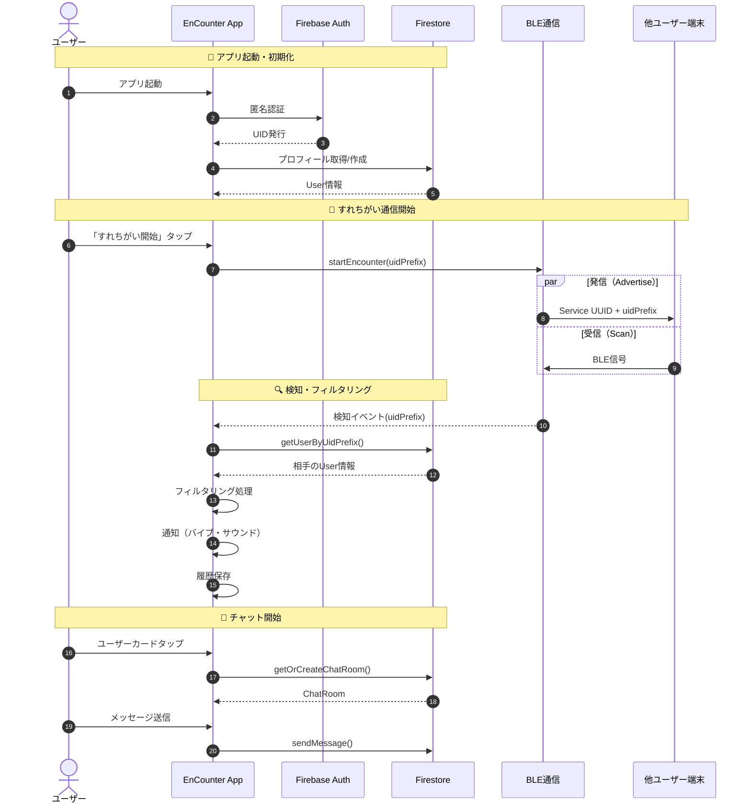

### 技術スタック

| カテゴリ | 技術 |
|:--|:--|
| **言語** | Kotlin 2.0+ |
| **UI** | Jetpack Compose |
| **DI** | Hilt (Dagger) |
| **非同期** | Kotlin Coroutines + Flow |
| **データベース** | Firebase Firestore |
| **認証** | Firebase Auth (匿名認証) |
| **BLE** | Android BLE API (BluetoothLeScanner, BluetoothLeAdvertiser) |
| **ローカル永続化** | SharedPreferences |
| **ビルド** | Gradle Kotlin DSL |

### 対応Android

| 項目 | 値 |
|:--|:--|
| minSdk | 26 (Android 8.0) |
| targetSdk | 36 |
| compileSdk | 36 |

---

## システム概要

### アーキテクチャ

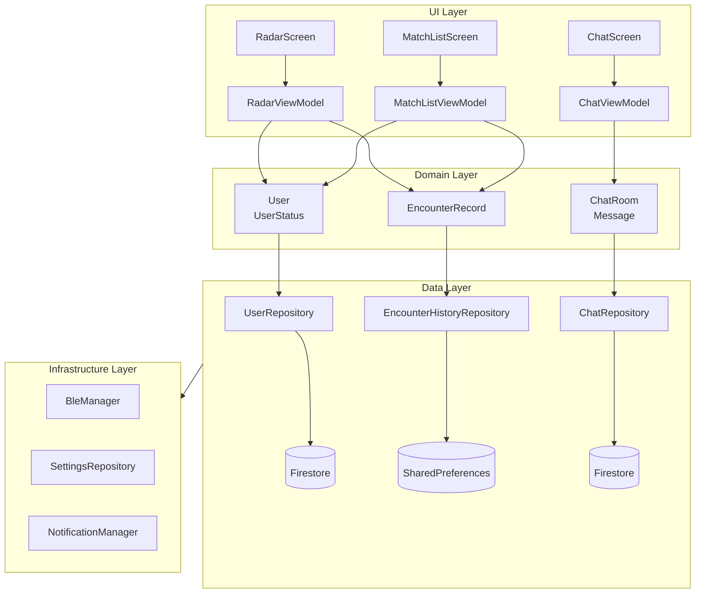

### 主要機能

| 機能 | 説明 |
|:--|:--|
| **BLEすれちがい検知** | 周囲のEnCounterユーザーをBLEでリアルタイム検知 |
| **マッチング・フィルタリング** | ステータスと興味タグに基づく条件付きマッチング |
| **すれちがい履歴** | 検知したユーザーの永続化・履歴管理 |
| **チャット** | マッチしたユーザーとのリアルタイムチャット |
| **ステルスモード** | 自分を見せずに他者を検知するモード |
| **通知** | 検知時のバイブレーション・サウンド通知 |

### 機能間の関係図

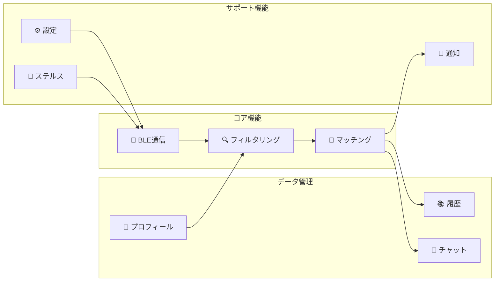

---

## モジュール構成

### ディレクトリ構造

```
app/src/main/java/com/encounter/app/
├── EnCounterApplication.kt    # Applicationクラス（Hilt初期化）
├── MainActivity.kt            # エントリーポイント
├── ble/                       # BLE通信モジュール
│   └── BleManager.kt          # BLE制御（Advertise/Scan）
├── data/                      # データ層
│   └── repository/
│       ├── UserRepository.kt           # ユーザー情報（Firebase）
│       ├── ChatRepository.kt           # チャット（Firebase）
│       ├── EncounterHistoryRepository.kt  # すれちがい履歴（Local）
│       └── SettingsRepository.kt       # 設定（Local）
├── debug/                     # デバッグ機能
├── di/                        # 依存性注入
│   └── AppModule.kt           # Hiltモジュール定義
├── domain/                    # ドメイン層
│   └── model/
│       ├── User.kt            # ユーザーモデル・ステータス
│       ├── EncounterRecord.kt # すれちがい記録モデル
│       └── ChatRoom.kt        # チャットルーム・メッセージモデル
├── navigation/                # 画面遷移
│   ├── Screen.kt              # ルート定義
│   └── AppNavGraph.kt         # ナビゲーショングラフ
├── notification/              # 通知機能
│   └── EncounterNotificationManager.kt  # バイブ・サウンド
└── ui/                        # UI層（フロントエンド）
    ├── screens/
    │   ├── radar/             # レーダー画面
    │   ├── matchlist/         # すれちがい図鑑
    │   ├── chat/              # チャット画面
    │   ├── profile/           # プロフィール設定
    │   ├── settings/          # 設定画面
    │   └── ...
    └── theme/                 # テーマ定義
```

---

## BLE通信システム

### 概要

BLE（Bluetooth Low Energy）を使用して、周囲のEnCounterユーザーを検知します。

- **Advertise（発信）**: 自分のuidPrefixをBLEで周囲にブロードキャスト
- **Scan（受信）**: 周囲のEnCounterユーザーからのBLE信号を受信

### BleManager クラス

**ファイル**: `ble/BleManager.kt`

#### 定数

| 定数 | 値 | 説明 |
|:--|:--|:--|
| `SERVICE_UUID` | `0000EC00-0000-1000-8000-00805F9B34FB` | EnCounter専用Service UUID |
| `DEFAULT_RSSI_THRESHOLD` | -70 dBm | デフォルト受信感度閾値 |

#### 受信感度プリセット（ScanSensitivity）

| プリセット | RSSI閾値 | 検知距離の目安 |
|:--|:--|:--|
| `HIGH` | -85 dBm | 約10m以上 |
| `MEDIUM` | -70 dBm | 約5m |
| `LOW` | -50 dBm | 約1-2m |

#### 送信電力プリセット（TxPowerLevel）

| プリセット | 到達距離の目安 |
|:--|:--|
| `HIGH` | 約10m以上 |
| `MEDIUM` | 約5-8m |
| `LOW` | 約1-3m |
| `ULTRA_LOW` | 約0.5-1m |

### BLE通信フロー

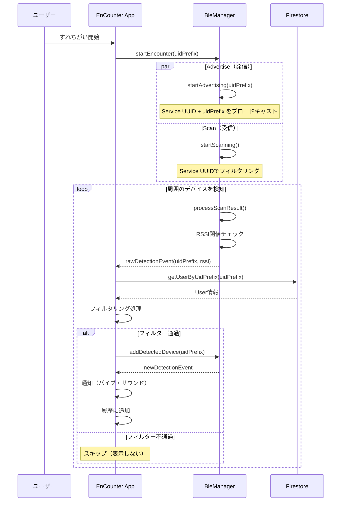

### ステルスモード

ステルスモードを有効にすると、**発信（Advertise）を停止**し、**受信（Scan）のみ**になります。

```kotlin
fun setStealthMode(enabled: Boolean) {
    _isStealthMode.value = enabled
    if (enabled && _isAdvertising.value) {
        stopAdvertising()  // 発信停止
    }
}
```

---

## データ管理

### Firestore データ構造

#### ER図（エンティティ関係図）

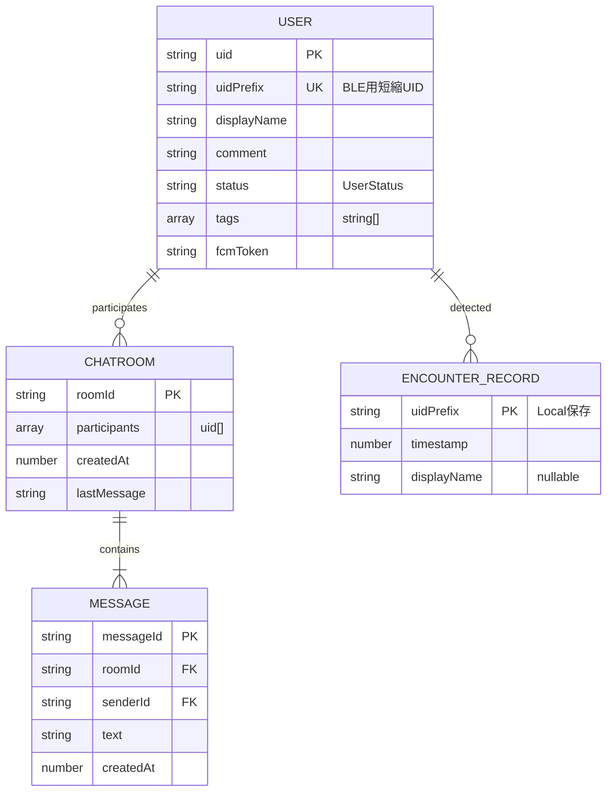

#### users コレクション

```
users/
└── {uid}/
    ├── uid: string              # Firebase Auth UID
    ├── uidPrefix: string        # BLE用短縮UID（16文字）
    ├── displayName: string      # 表示名
    ├── comment: string          # 一言コメント
    ├── status: string           # UserStatus（OPEN, BORED, etc.）
    ├── tags: array<string>      # 興味タグ
    └── fcmToken: string         # プッシュ通知用トークン
```

#### chatRooms コレクション

```
chatRooms/
└── {roomId}/
    ├── roomId: string
    ├── participants: array<string>  # 参加者UIDリスト（ソート済み）
    ├── createdAt: number
    ├── lastMessage: string
    └── messages/                    # サブコレクション
        └── {messageId}/
            ├── messageId: string
            ├── senderId: string
            ├── text: string
            └── createdAt: number
```

### UserRepository

**ファイル**: `data/repository/UserRepository.kt`

#### 主要メソッド

| メソッド | 説明 |
|:--|:--|
| `signInAnonymously()` | Firebase匿名認証でログイン |
| `saveUserProfile(user)` | プロフィール保存（uidPrefixを自動設定） |
| `getUser(uid)` | UID指定でユーザー取得 |
| `getUsersByIds(uidPrefixes)` | 複数uidPrefixでバッチ取得（30件ずつチャンク） |
| `getUserByUidPrefix(uidPrefix)` | 単一uidPrefixで取得（**キャッシュ付き**） |
| `observeCurrentUser()` | 現在ユーザーをリアルタイム監視 |
| `clearUserCache()` | キャッシュクリア |

#### キャッシュシステム

BLEでは同じユーザーが何度も検知されるため、**uidPrefixベースのキャッシュ**でFirebase照会数を削減します。

```kotlin
private val userCache = mutableMapOf<String, User?>()

suspend fun getUserByUidPrefix(uidPrefix: String): User? {
    // キャッシュ確認
    if (userCache.containsKey(uidPrefix)) {
        return userCache[uidPrefix]  // キャッシュヒット
    }
    
    // Firestore照会
    val user = firestore.collection("users")
        .whereEqualTo("uidPrefix", uidPrefix)
        .limit(1)
        .get()
        .await()
        .documents.firstOrNull()?.toObject(User::class.java)
    
    // キャッシュに保存（nullもキャッシュ）
    userCache[uidPrefix] = user
    return user
}
```

### EncounterHistoryRepository

**ファイル**: `data/repository/EncounterHistoryRepository.kt`

すれちがい履歴を**SharedPreferences**で永続化します。

| 項目 | 値 |
|:--|:--|
| 最大保存件数 | 1,000件 |
| 保存形式 | JSON配列 |
| 重複時の挙動 | タイムスタンプ・名前を更新 |

```kotlin
data class EncounterRecord(
    val uidPrefix: String,     // BLEで検知したUID（16文字）
    val timestamp: Long,       // すれちがった日時
    val displayName: String?   // ユーザー名（キャッシュ用）
)
```

**設計意図**:
- Firebase Firestoreではなくローカル保存を採用
- 理由: データ量が多くなる可能性、オフライン動作、コスト最適化
- SharedPreferencesで十分な規模（最大1,000件程度を想定）

---

## マッチング・フィルタリングロジック

### UserStatus（気分ステータス）

プロダクトの核心機能。多彩な気分表現を実現します。

| ステータス | 表示名 | 絵文字 | 分類 |
|:--|:--|:--|:--|
| `OPEN` | 話しかけてOK | 👋 | 積極的 |
| `BORED` | 暇してます | 😴 | 積極的 |
| `LOOKING_FOR_HELP` | 誰か助けて | 🆘 | 積極的 |
| `GAME_PARTNER` | ゲーム仲間募集 | 🎮 | 積極的 |
| `COFFEE` | カフェ行きたい | ☕ | 積極的 |
| `COMMUTING` | 移動中 | 🚃 | 状況系 |
| `WORKING` | 作業中 | 💻 | 状況系 |
| `BUSY` | 忙しい | 🔴 | 非アクティブ系 |
| `OFFLINE` | オフライン | ⚫ | 非表示 |

#### ステータス状態遷移図

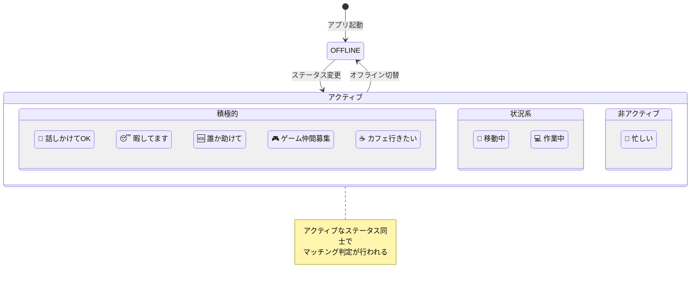

### フィルタリング条件

検知時に以下の**すべての条件**を満たした場合のみ、ユーザーに表示されます。

1. **自分がアクティブ**: 自分のステータスがOFFLINE以外
2. **相手がアクティブ**: 相手のステータスがOFFLINE以外
3. **ステータス一致**: 自分と相手のステータスが同じ
4. **タグ一致**: 興味タグが1つ以上一致

```kotlin
// RadarViewModel.processNewDetection()

// 1. 自分がOFFLINEの場合はスキップ
if (!myUser.status.isActive()) return

// 2. Firebase照会（相手の情報取得）
val detectedUser = userRepository.getUserByUidPrefix(uidPrefix)
if (detectedUser == null) return

// 3. 相手がOFFLINEの場合はスキップ
if (!detectedUser.status.isActive()) return

// 4. ステータスが一致するか確認
if (myUser.status != detectedUser.status) return

// 5. 興味タグが1つ以上一致するか確認
val commonTags = myUser.tags.intersect(detectedUser.tags.toSet())
if (commonTags.isEmpty()) return

// フィルター通過 → 検知リストに追加
bleManager.addDetectedDevice(uidPrefix)
```

### フィルタリング・フロー図

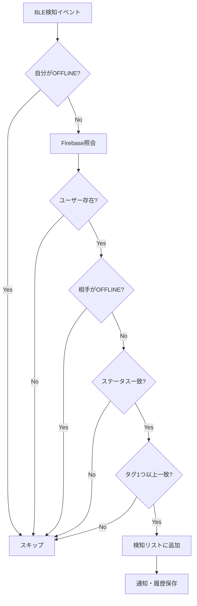

---

## 通知システム

### 通知フロー図

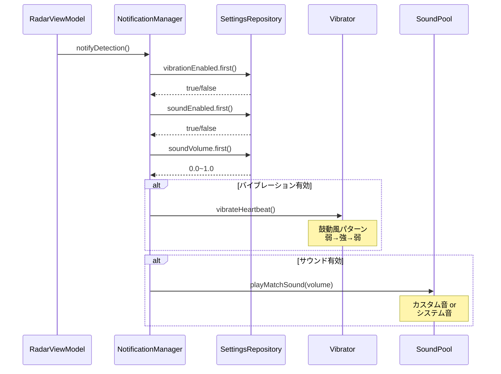

### EncounterNotificationManager

**ファイル**: `notification/EncounterNotificationManager.kt`

検知時のバイブレーションと音声通知を管理します。

#### バイブレーションパターン

**鼓動風パターン（Heartbeat）**:
```kotlin
// タイミング: 0ms開始, 100ms振動, 50ms休止, 300ms振動, 50ms休止, 100ms振動
val HEARTBEAT_PATTERN = longArrayOf(0, 100, 50, 300, 50, 100)
// 振幅（0=休止, 255=最大強度）
val HEARTBEAT_AMPLITUDES = intArrayOf(0, 120, 0, 255, 0, 120)
```

#### 音声通知

- **SoundPool**を使用（低遅延・軽量）
- カスタムサウンド: `res/raw/notification_match.mp3`
- サウンドファイルがない場合はシステムデフォルト音を使用

#### 設定連携

```kotlin
fun notifyDetection() {
    val vibrationEnabled = settingsRepository.vibrationEnabled.first()
    val soundEnabled = settingsRepository.soundEnabled.first()
    val volume = settingsRepository.soundVolume.first()
    
    if (vibrationEnabled) vibrateHeartbeat()
    if (soundEnabled) playMatchSound(volume)
}
```

---

## 永続化

### SettingsRepository

**ファイル**: `data/repository/SettingsRepository.kt`

設定値を**SharedPreferences**で永続化します。

#### 設定適用フロー

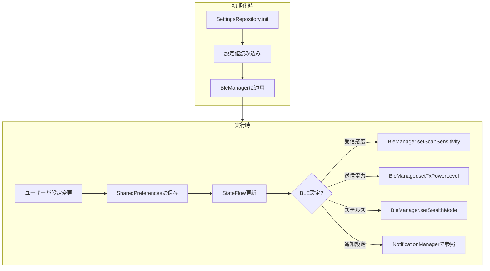

#### 保存される設定

| 設定 | キー | デフォルト値 |
|:--|:--|:--|
| 受信感度 | `scan_sensitivity` | `MEDIUM` |
| 送信電力 | `tx_power_level` | `MEDIUM` |
| バイブレーション | `vibration_enabled` | `true` |
| 音声通知 | `sound_enabled` | `true` |
| 音量 | `sound_volume` | `0.7f` |
| ステルスモード | `stealth_mode` | `false` |

#### 初期化時の設定適用

```kotlin
init {
    // 初回起動時にBleManagerに設定を適用
    applyBleSensitivity(_scanSensitivity.value)
    applyTxPowerLevel(_txPowerLevel.value)
    applyStealthMode(_stealthMode.value)
}
```

---

## 依存性注入（DI）

### DIコンポーネント関係図

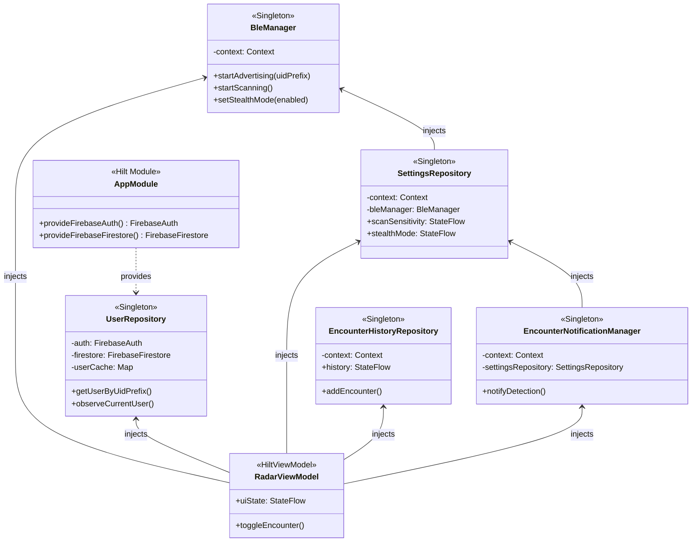

### Hilt構成

**ファイル**: `di/AppModule.kt`

```kotlin
@Module
@InstallIn(SingletonComponent::class)
object AppModule {

    @Provides
    @Singleton
    fun provideFirebaseAuth(): FirebaseAuth = FirebaseAuth.getInstance()

    @Provides
    @Singleton
    fun provideFirebaseFirestore(): FirebaseFirestore = FirebaseFirestore.getInstance()
}
```

### Singletonクラス

以下のクラスは`@Singleton`スコープで提供されます：

| クラス | 役割 |
|:--|:--|
| `BleManager` | BLE通信の全体管理 |
| `UserRepository` | ユーザー情報のFirebase連携 |
| `ChatRepository` | チャット機能のFirebase連携 |
| `EncounterHistoryRepository` | すれちがい履歴のローカル保存 |
| `SettingsRepository` | 設定のローカル保存 |
| `EncounterNotificationManager` | 通知（バイブ・サウンド） |

---

## データフロー

### すれちがい検知からUI表示までの流れ

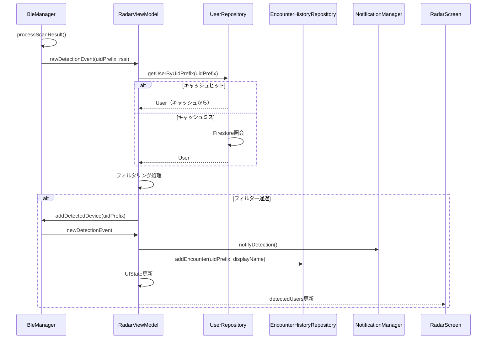

### StateFlow によるUI更新

```kotlin
data class RadarUiState(
    val isScanning: Boolean = false,
    val isAdvertising: Boolean = false,
    val isStealthMode: Boolean = false,
    val detectedDeviceCount: Int = 0,
    val detectedDevices: Set<String> = emptySet(),
    val detectedUsers: Map<String, User> = emptyMap(),
    val detectedTimestamps: Map<String, Long> = emptyMap(),
    // ...
)
```

---

## パフォーマンス最適化

### キャッシュシステムのフロー

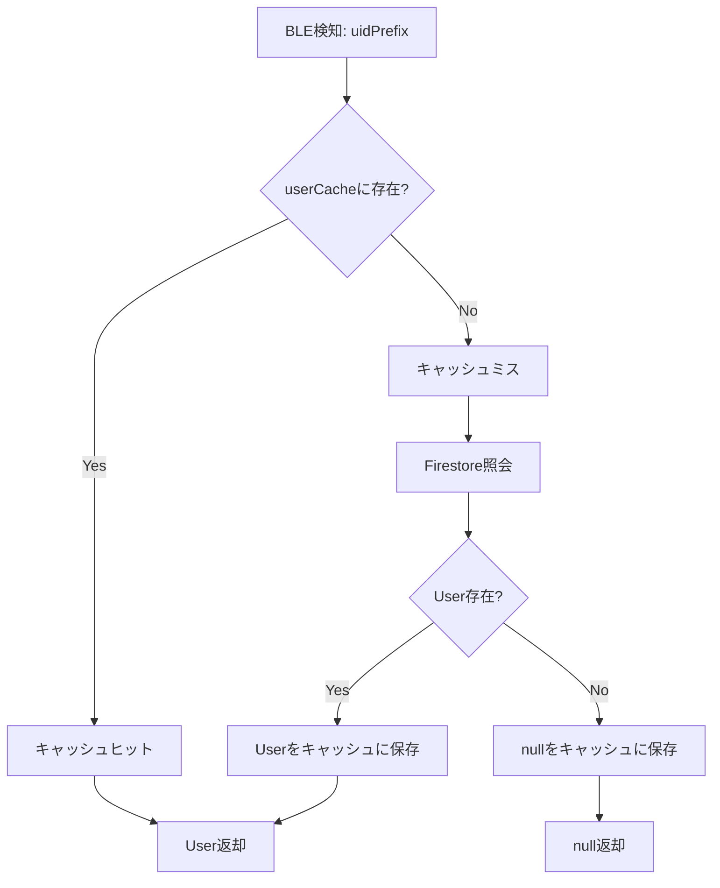

### 1. uidPrefixキャッシュ

BLE検知では同じユーザーが繰り返し検知されるため、`UserRepository`にキャッシュを実装。

- **キャッシュヒット時**: Firebase照会なし
- **キャッシュミス時**: 1回だけ照会してキャッシュに保存
- **nullもキャッシュ**: 未登録ユーザーの再照会を防止

### 2. Firestoreバッチクエリ

`getUsersByIds()`では、Firestoreの`whereIn`制限（30件）に対応してチャンク分割。

```kotlin
uidPrefixes.chunked(30).forEach { chunk ->
    firestore.collection("users")
        .whereIn("uidPrefix", chunk)
        .get()
    // ...
}
```

### 3. 非同期処理の並列化

`rawDetectionEvent`の処理は`launch`で非同期実行し、BLE検知をブロックしない。

```kotlin
bleManager.rawDetectionEvent.collect { event ->
    launch {  // 非同期処理（ブロックしない）
        processNewDetection(event.uidPrefix, event.rssi)
    }
}
```

### 4. SharedFlowのバッファ

BLE検知は短時間に複数発生する可能性があるため、バッファを設定。

```kotlin
private val _rawDetectionEvent = MutableSharedFlow<NewDetectionEvent>(
    extraBufferCapacity = 20
)
```

### パフォーマンス最適化の全体像

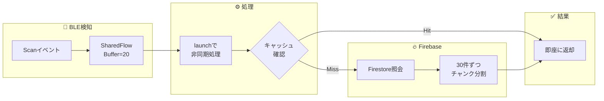

---

## トラブルシューティング

### 問題切り分けフロー

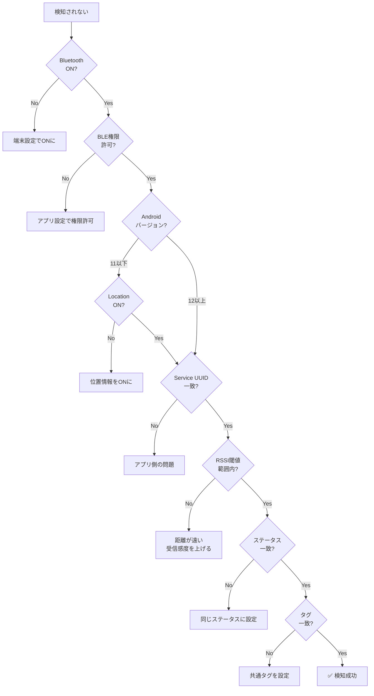

### BLEスキャンが動作しない

| 原因 | 解決策 |
|:--|:--|
| Bluetooth無効 | 端末設定でBluetoothをONに |
| 権限未許可 | アプリに`BLUETOOTH_SCAN`, `BLUETOOTH_ADVERTISE`権限を許可 |
| 位置情報無効（Android 11以下） | 端末設定で位置情報をONに |

### ユーザーが検知されない

| 原因 | 解決策 |
|:--|:--|
| ステータスがOFFLINE | アクティブなステータスに変更 |
| ステータス不一致 | 相手と同じステータスに設定 |
| タグ不一致 | 共通のタグを設定 |
| 距離が遠い | 受信感度を「高感度」に変更 |
| ステルスモード中 | 設定画面でステルスモードをOFFに |

### キャッシュの問題

アプリ起動時に`UserRepository.clearUserCache()`が呼ばれます。手動でクリアする場合は「検知リストクリア」機能を使用してください。

---

## 更新履歴

| 日付 | バージョン | 変更内容 |
|:--|:--|:--|
| 2026-02-06 | 1.0.0 | 初版作成 |
