# EnCounter フロントエンド仕様書

**バージョン**: 1.0.0  
**作成日**: 2026年2月6日  
**システム**: Android Native (Kotlin + Jetpack Compose)

---

## 📑 目次

- [📑 目次](#-目次)
- [概要](#概要)
- [技術スタック](#技術スタック)
- [ディレクトリ構成](#ディレクトリ構成)
- [画面構成](#画面構成)
- [ルーティング構成](#ルーティング構成)
- [デザインシステム](#デザインシステム)
- [コンポーネント設計パターン](#コンポーネント設計パターン)
- [状態管理](#状態管理)
- [ユーティリティ](#ユーティリティ)
- [スクリーンショット](#スクリーンショット)
- [実装例集](#実装例集)
- [今後の拡張予定](#今後の拡張予定)
- [関連ドキュメント](#関連ドキュメント)

---

## 概要

EnCounter フロントエンドは、Jetpack Compose + Material 3 ベースのAndroid ネイティブUIです。ドット絵RPG風のデザインシステムを採用し、「冒険」「すれちがい」「一期一会」の世界観を表現しています。

### システム構成

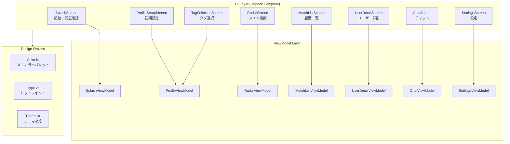

### 主要機能

| 機能 | 説明 |
|:--|:--|
| **すれちがいレーダー** | リアルタイムBLE検知結果をレーダー風UIで表示 |
| **プロフィール設定** | ニックネーム・ひとこと・ステータス・興味タグの設定 |
| **すれちがい図鑑** | 過去の検知履歴を時系列で一覧表示 |
| **ユーザー詳細** | すれ違ったユーザーのプロフィール閲覧 |
| **チャット** | マッチしたユーザーとのリアルタイムメッセージング |
| **設定** | BLE感度・通知・ステルスモードの設定 |

---

## 技術スタック

### コアライブラリ

| カテゴリ | ライブラリ | バージョン |
|:--|:--|:--|
| **言語** | Kotlin | 2.0+ |
| **UI** | Jetpack Compose | Material 3 |
| **ナビゲーション** | Navigation Compose | 2.7+ |
| **DI** | Hilt | 2.51+ |
| **非同期** | Kotlin Coroutines + Flow | 1.8+ |
| **状態管理** | StateFlow + collectAsState | - |

### 依存関係 (抜粋)

```kotlin
// Jetpack Compose
implementation("androidx.compose.material3:material3")
implementation("androidx.compose.ui:ui")
implementation("androidx.compose.ui:ui-tooling-preview")
implementation("androidx.activity:activity-compose")

// Navigation
implementation("androidx.navigation:navigation-compose")
implementation("androidx.hilt:hilt-navigation-compose")

// Hilt
implementation("com.google.dagger:hilt-android")
kapt("com.google.dagger:hilt-compiler")
```

### ビルド設定

| 項目 | 値 |
|:--|:--|
| minSdk | 26 (Android 8.0) |
| targetSdk | 36 |
| compileSdk | 36 |

---

## ディレクトリ構成

```
app/src/main/java/com/encounter/app/
├── ui/
│   ├── screens/
│   │   ├── splash/         # スプラッシュ画面
│   │   │   ├── SplashScreen.kt
│   │   │   └── SplashViewModel.kt
│   │   ├── profile/        # プロフィール関連
│   │   │   ├── ProfileSetupScreen.kt
│   │   │   ├── ProfileEditScreen.kt
│   │   │   ├── TagSelectionScreen.kt
│   │   │   └── ProfileViewModel.kt
│   │   ├── radar/          # レーダー画面
│   │   │   ├── RadarScreen.kt
│   │   │   └── RadarViewModel.kt
│   │   ├── matchlist/      # すれちがい図鑑
│   │   │   ├── MatchListScreen.kt
│   │   │   └── MatchListViewModel.kt
│   │   ├── userdetail/     # ユーザー詳細
│   │   │   ├── UserDetailScreen.kt
│   │   │   └── UserDetailViewModel.kt
│   │   ├── chat/           # チャット
│   │   │   ├── ChatScreen.kt
│   │   │   └── ChatViewModel.kt
│   │   ├── settings/       # 設定
│   │   │   ├── SettingsScreen.kt
│   │   │   └── SettingsViewModel.kt
│   │   └── help/           # ヘルプ
│   │       └── HelpScreen.kt
│   ├── theme/
│   │   ├── Color.kt        # RPGカラーパレット
│   │   ├── Theme.kt        # テーマ定義
│   │   └── Type.kt         # タイポグラフィ
│   ├── components/         # 共通コンポーネント
│   │   └── Profile.kt
│   └── utils/              # ユーティリティ
│       ├── NavigationUtils.kt
│       └── TimeUtils.kt
├── navigation/
│   ├── Screen.kt           # ルート定義
│   └── AppNavGraph.kt      # ナビゲーショングラフ
└── MainActivity.kt
```

---

## 画面構成

### 画面遷移フロー

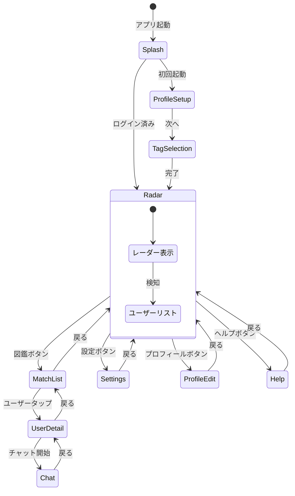

### アプリ使用の流れ（全体図）

<div align="center">
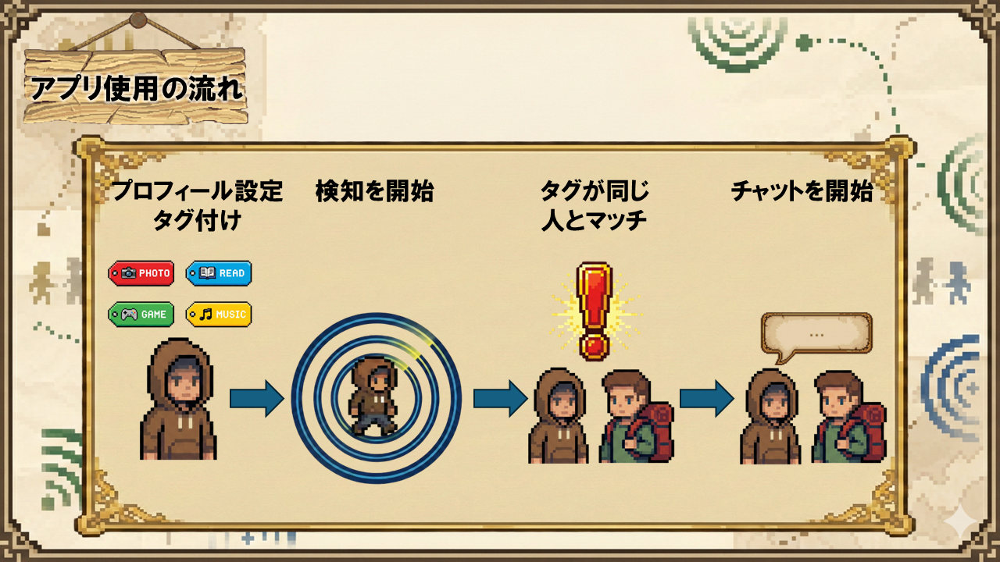
</div>

EnCounterの主要な画面遷移とユーザージャーニーを示した図です。プロフィール設定からマッチング、チャットまでの一連の流れが視覚的に理解できます。

---

### 1. SplashScreen - スプラッシュ画面

**パス**: `splash`

**目的**: アプリ起動時の認証確認・自動ログイン

**主要機能**:
- Firebase Auth の認証状態確認
- 既存ユーザー → Radar画面へ遷移
- 新規ユーザー → ProfileSetup画面へ遷移
- エラー時のリトライ機能

**状態**:

```kotlin
data class SplashUiState(
    val isLoading: Boolean = true,
    val error: String? = null,
    val navigationTarget: NavigationTarget? = null
)

sealed class NavigationTarget {
    data object ProfileSetup : NavigationTarget()
    data object Radar : NavigationTarget()
}
```

**イベント**: なし（状態のみで制御）

---

### 2. ProfileSetupScreen - プロフィール設定画面

**パス**: `profile_setup` (ProfileFlow内)

**目的**: 初回起動時のプロフィール設定（ニックネーム・ひとこと）

**主要機能**:
- ニックネーム入力（最大12文字）
- ひとこと入力（最大50文字、任意）
- ロゴのフローティングアニメーション
- フォームのスライドインアニメーション

**UI特徴**:
- `AnimatedVisibility` によるロゴのスケールイン + フェードイン
- `infiniteRepeatable` による上下浮遊アニメーション
- フォームの下からスライドイン

**状態**:

```kotlin
data class ProfileUiState(
    val displayName: String = "",
    val comment: String = "",
    val selectedStatus: UserStatus = UserStatus.NONE,
    val selectedTags: Set<String> = emptySet(),
    val isLoading: Boolean = false,
    val isEditMode: Boolean = false // 編集モードかどうか
) {
    companion object {
        const val MAX_DISPLAY_NAME_LENGTH = 12
        const val MAX_COMMENT_LENGTH = 50
    }
}
```

---

### 3. TagSelectionScreen - タグ選択画面

**パス**: `tag_selection` (ProfileFlow内)

**目的**: 興味タグの選択（マッチング条件）

**主要機能**:
- 複数タグの選択（最低1つ必須）
- 木の看板風UI
- 掲示板スタイルのタグリスト
- `FilterChip` によるタグ選択

**利用可能タグ**:

| カテゴリ | タグ |
|:--|:--|
| 趣味 | ゲーム, 音楽, 映画, 旅行, スポーツ, 読書, 料理, 写真, アート, DIY |
| ジャンル | アニメ, 漫画, ドラマ, アイドル, K-POP |
| ライフスタイル | カフェ, グルメ, ファッション, フィットネス, 推し活, ペット |
| テック | プログラミング, ガジェット |
| その他 | 勉強, 雑談, 暇つぶし |

**UI特徴**:
- 吊り下げ看板風のタイトルエリア (`header_board.png`)
- 木目背景のタグエリア (`wood_background.png`)
- `FlowRow` による可変グリッドレイアウト

---

### 4. RadarScreen - レーダー画面（メイン）

**パス**: `radar`

**目的**: すれちがい検知のメイン画面

**主要機能**:
- BLEスキャン/アドバタイズの開始・停止
- 検知ユーザーのリアルタイム表示
- レーダー風アニメーション（パルス効果）
- 検知ユーザーリストのスクロール表示
- 検知履歴のクリア

**TopBarアクション**:
- プロフィール編集 (`Person` icon)
- 設定 (`Settings` icon)
- ヘルプ (`Info` icon)

**FAB**: すれちがい図鑑への遷移

**状態**:

```kotlin
data class RadarUiState(
    val isScanning: Boolean = false,
    val isAdvertising: Boolean = false,
    val detectedDevices: List<String> = emptyList(),      // uidPrefix一覧
    val detectedUsers: Map<String, User> = emptyMap(),    // uidPrefix -> User
    val hasPermission: Boolean = false,
    val permissionDeniedPermanently: Boolean = false
)
```

**イベント**:

```kotlin
sealed class RadarUiEvent {
    data object RequestPermissions : RadarUiEvent()
    data object NavigateToSettings : RadarUiEvent()
    data class ShowError(val message: String) : RadarUiEvent()
}
```

### 検知モード（通常モード vs ステルスモード）

<div align="center">
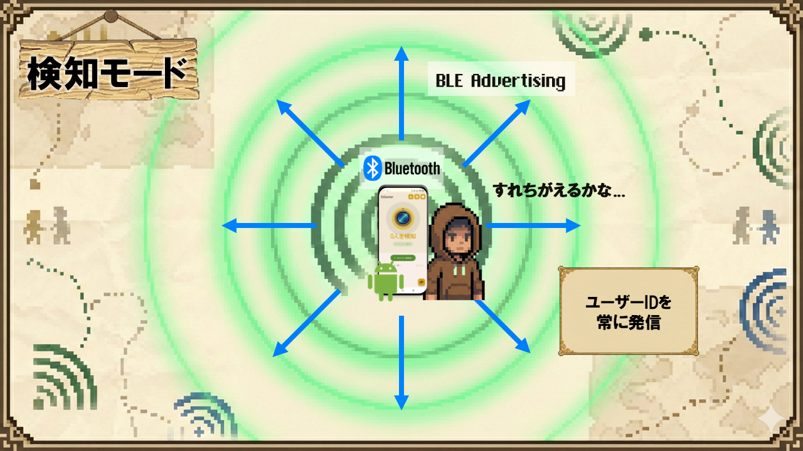
</div>

EnCounterには2つの検知モードがあります：
- **通常モード**: BLE Advertise（送信）とScan（受信）の両方を行い、お互いに検知できる
- **ステルスモード**: Scan（受信）のみを行い、自分は見えずに周囲を検知できる

この図は、各モードでのBLE通信の挙動と、検知される範囲を視覚的に示しています。

---

### 5. MatchListScreen - すれちがい図鑑画面

**パス**: `match_list`

**目的**: 過去のすれちがい履歴を一覧表示

**主要機能**:
- 時系列でのユーザーリスト表示
- 個別ユーザーの削除（スワイプ）
- 全履歴の一括削除（確認ダイアログ付き）
- 「相対時間」形式での表示（例: 「5分前」）

**TopBarアクション**:
- 戻るボタン
- 全削除ボタン（ゴミ箱アイコン）

**状態**:

```kotlin
data class MatchListUiState(
    val encounters: List<EncounterRecord> = emptyList(),
    val filteredUsers: List<User> = emptyList(),
    val encounterRecords: List<EncounterRecord> = emptyList(),
    val isLoading: Boolean = true,
    val showDeleteConfirmDialog: Boolean = false
)
```

---

### 6. UserDetailScreen - ユーザー詳細画面

**パス**: `user_detail/{userId}`

**目的**: すれ違ったユーザーのプロフィール閲覧・チャット開始

**主要機能**:
- ユーザープロフィール表示（アバター、名前、ステータス、タグ）
- RPG風吹き出しによるコメント表示
- 「チャットを始める」ボタン

**UI特徴**:
- `RpgSpeechBubble` - 上向き三角形 + 丸角四角形の吹き出し
- アバター画像の円形クリップ

**状態**:

```kotlin
data class UserDetailUiState(
    val user: User? = null,
    val isLoading: Boolean = true,
    val isStartingChat: Boolean = false
)
```

---

### 7. ChatScreen - チャット画面

**パス**: `chat/{roomId}`

**目的**: マッチしたユーザーとのリアルタイムチャット

**主要機能**:
- リアルタイムメッセージ送受信（Firebase Firestore）
- キーボード表示時の自動スクロール
- メッセージ送信中のローディング表示

**UI特徴**:
- `LazyColumn` による効率的なリスト描画
- `imePadding()` によるキーボード追従
- 自分/相手のメッセージで左右配置を変更
- 送信ボタンの活性/非活性制御

**キーボード追従アルゴリズム**:

```kotlin
// キーボードが開く前、一番下にいた場合のみ自動スクロール
LaunchedEffect(isImeVisible, bottomPadding) {
    if (isImeVisible && wasAtBottomBeforeIme) {
        listState.animateScrollToItem(messages.lastIndex)
    }
}
```

---

### 8. SettingsScreen - 設定画面

**パス**: `settings`

**目的**: アプリの各種設定

**設定項目**:

| セクション | 項目 | 説明 |
|:--|:--|:--|
| **検知設定** | 受信感度 | LOW / MEDIUM / HIGH（検知距離） |
| | 発信強度 | ULTRA_LOW / LOW / MEDIUM / HIGH（届く距離） |
| **通知設定** | バイブレーション | ON/OFF |
| | サウンド | ON/OFF |
| | 音量 | スライダー（0-100%） |
| **プライバシー** | ステルスモード | 自分を見せずに検知 |

**状態**:

```kotlin
data class SettingsUiState(
    val scanSensitivity: ScanSensitivity = ScanSensitivity.MEDIUM,
    val txPowerLevel: TxPowerLevel = TxPowerLevel.MEDIUM,
    val vibrationEnabled: Boolean = true,
    val soundEnabled: Boolean = true,
    val soundVolume: Float = 0.7f,
    val stealthMode: Boolean = false,
    val distanceDescription: String = ""
)
```

---

### 9. ProfileEditScreen - プロフィール編集画面

**パス**: `profile_edit`

**目的**: 既存プロフィールの編集

**主要機能**:
- ニックネーム・ひとこと編集
- ステータス変更（9種類のプリセット）
- 興味タグ編集
- 変更の保存

**ステータス一覧**:

| ステータス | 説明 |
|:--|:--|
| NONE | 未設定 |
| BORED | 暇してます |
| WANT_FRIENDS | 友達募集中 |
| WANT_TALK | 話し相手募集 |
| WANT_PLAY | 一緒に遊ぼう |
| LOOKING_FOR | 探し物中 |
| WORKING | お仕事中 |
| RELAXING | まったり |
| EXCITED | ワクワク |
| TIRED | お疲れモード |

---

### 10. HelpScreen - ヘルプ画面

**パス**: `help`

**目的**: アプリの使い方説明

**内容**:
```
1. レーダー画面で周囲のユーザーを検知
2. すれちがいリストで気になる人を確認
3. タグが合う人とチャットを開始

※ Bluetoothをオンにしてお使いください
```

---

## ルーティング構成

### ルート定義

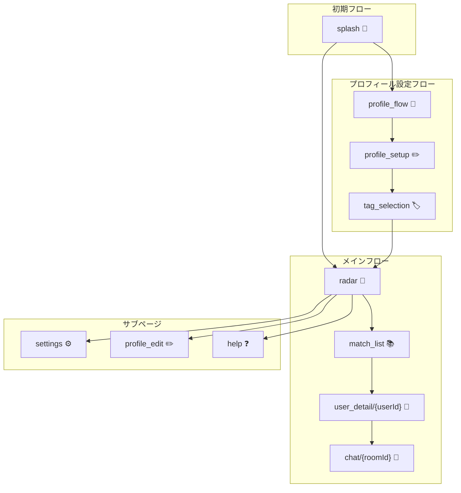

### Screen定義

```kotlin
sealed class Screen(val route: String) {
    // 初期設定フロー
    data object Splash : Screen("splash")
    
    // プロフィール設定フロー（ネスト）
    data object ProfileFlow : Screen("profile_flow")
    data object ProfileSetup : Screen("profile_setup")
    data object TagSelection : Screen("tag_selection")
    
    // メイン画面
    data object Radar : Screen("radar")
    data object MatchList : Screen("match_list")
    
    // 詳細画面（引数付き）
    data object UserDetail : Screen("user_detail/{userId}") {
        fun createRoute(userId: String) = "user_detail/$userId"
    }
    data object Chat : Screen("chat/{roomId}") {
        fun createRoute(roomId: String) = "chat/$roomId"
    }
    
    // その他
    data object ProfileEdit : Screen("profile_edit")
    data object Settings : Screen("settings")
    data object Help : Screen("help")
}
```

### ViewModel共有（ProfileFlow）

ProfileSetupとTagSelectionは同一のViewModelを共有:

```kotlin
navigation(
    startDestination = Screen.ProfileSetup.route,
    route = Screen.ProfileFlow.route
) {
    composable(Screen.ProfileSetup.route) { backStackEntry ->
        val parentEntry = remember(backStackEntry) {
            navController.getBackStackEntry(Screen.ProfileFlow.route)
        }
        val viewModel: ProfileViewModel = hiltViewModel(parentEntry)
        // ...
    }
    
    composable(Screen.TagSelection.route) { backStackEntry ->
        val parentEntry = remember(backStackEntry) {
            navController.getBackStackEntry(Screen.ProfileFlow.route)
        }
        val viewModel: ProfileViewModel = hiltViewModel(parentEntry)
        // ...
    }
}
```

---

## デザインシステム

### カラーパレット

EnCounterはドット絵RPG風のカラーパレットを採用しています。

#### メインカラー

| 名前 | 色見本 | Hex | 用途 |
|:--|:--:|:--|:--|
| `RpgGoldPrimary` |  | `#D4A017` | 重要なボタン、強調表示 |
| `RpgGoldLight` |  | `#FFD700` | ハイライト |
| `RpgGoldDark` |  | `#A67C00` | 影 |

#### セカンダリカラー

| 名前 | 色見本 | Hex | 用途 |
|:--|:--:|:--|:--|
| `RpgGreenSecondary` |  | `#558B2F` | すれちがい通信中など肯定的ステータス |
| `RpgGreenLight` |  | `#85BB5C` | ライト版 |

#### アクション/警告色

| 名前 | 色見本 | Hex | 用途 |
|:--|:--:|:--|:--|
| `RpgRedError` |  | `#C62828` | エラー、停止ボタン |
| `RpgRedLight` |  | `#EF5350` | ライト版 |

#### アクセント

| 名前 | 色見本 | Hex | 用途 |
|:--|:--:|:--|:--|
| `RpgManaBlue` |  | `#1E88E5` | リンク、補助情報 |
| `RetroSuccess` |  | `#2ECC71` | 成功、稼働中 |

#### ライトモード背景

| 名前 | 色見本 | Hex | 用途 |
|:--|:--:|:--|:--|
| `RpgParchmentBg` |  | `#FDF5E6` | メイン背景（羊皮紙） |
| `RpgParchmentSurface` |  | `#F0E6D2` | カード、リスト背景 |
| `RpgInkText` |  | `#3E2723` | テキスト（焦げ茶） |

#### ダークモード背景

| 名前 | 色見本 | Hex | 用途 |
|:--|:--:|:--|:--|
| `RpgDungeonBg` |  | `#1A1B26` | メイン背景（深夜洞窟） |
| `RpgStoneSurface` |  | `#2F3242` | カード、リスト背景（石壁） |
| `RpgMoonText` |  | `#E0E0E0` | テキスト（月明かり） |

### テーマ設定

```kotlin
@Composable
fun EnCounterTheme(
    darkTheme: Boolean = isSystemInDarkTheme(),
    dynamicColor: Boolean = false,  // RPGの世界観を守るためデフォルトOFF
    content: @Composable () -> Unit
) {
    val colorScheme = when {
        dynamicColor && Build.VERSION.SDK_INT >= Build.VERSION_CODES.S -> {
            if (darkTheme) dynamicDarkColorScheme(context) 
            else dynamicLightColorScheme(context)
        }
        darkTheme -> DarkColorScheme
        else -> LightColorScheme
    }
    
    MaterialTheme(
        colorScheme = colorScheme,
        typography = Typography,
        content = content
    )
}
```

### タイポグラフィ

EnCounterはドット絵フォント (`res/font/dot_font.ttf`) を全体に適用しています。

```kotlin
val DotFontFamily = FontFamily(
    Font(R.font.dot_font)
)

val Typography = Typography(
    displayLarge = TextStyle(
        fontFamily = DotFontFamily,
        fontWeight = FontWeight.Normal,
        fontSize = 57.sp
    ),
    titleLarge = TextStyle(
        fontFamily = DotFontFamily,
        fontWeight = FontWeight.Bold,
        fontSize = 22.sp
    ),
    bodyLarge = TextStyle(
        fontFamily = DotFontFamily,
        fontWeight = FontWeight.Normal,
        fontSize = 16.sp
    ),
    labelLarge = TextStyle(
        fontFamily = DotFontFamily,
        fontWeight = FontWeight.Medium,
        fontSize = 14.sp
    )
    // ...
)
```

---

## コンポーネント設計パターン

### Screen/Content分離パターン

ViewModelを使用するComposableはPreviewできないため、「外側（Screen）」と「内側（Content）」を分離しています。

```kotlin
// 外側: ViewModelを使用（Preview不可）
@Composable
fun XxxScreen(
    onNavigateToYyy: () -> Unit,
    viewModel: XxxViewModel = hiltViewModel()
) {
    val uiState by viewModel.uiState.collectAsState()
    
    LaunchedEffect(Unit) {
        viewModel.uiEvent.collect { event ->
            // イベント処理
        }
    }
    
    XxxScreenContent(
        uiState = uiState,
        onNavigateToYyy = onNavigateToYyy,
        onSomeAction = { viewModel.someAction() }
    )
}

// 内側: 状態を引数で受け取る（Preview可能）
@Composable
fun XxxScreenContent(
    uiState: XxxUiState,
    onNavigateToYyy: () -> Unit,
    onSomeAction: () -> Unit
) {
    Scaffold { paddingValues ->
        // UI実装
    }
}

// Preview
@Preview(showBackground = true)
@Composable
private fun XxxScreenPreview() {
    EnCounterTheme {
        XxxScreenContent(
            uiState = XxxUiState(),
            onNavigateToYyy = {},
            onSomeAction = {}
        )
    }
}
```

### 開発分担ルール

- **久米（Backend）**: ViewModel、UiState、UiEvent、状態監視ロジック
- **昆野（Frontend）**: UI実装、アニメーション、デザイン

```kotlin
// 久米実装: 変更禁止
val uiState by viewModel.uiState.collectAsState()

// 昆野担当: 自由に編集可能
XxxScreenContent(...)
```

---

## 状態管理

### StateFlow + collectAsState

ViewModelはStateFlowで状態を公開し、ComposableはcollectAsStateで監視します。

```kotlin
// ViewModel
class RadarViewModel @Inject constructor(...) : ViewModel() {
    private val _uiState = MutableStateFlow(RadarUiState())
    val uiState: StateFlow<RadarUiState> = _uiState.asStateFlow()
    
    private val _uiEvent = MutableSharedFlow<RadarUiEvent>()
    val uiEvent: SharedFlow<RadarUiEvent> = _uiEvent.asSharedFlow()
    
    fun toggleEncounter() {
        _uiState.update { it.copy(isScanning = !it.isScanning) }
    }
}

// Composable
@Composable
fun RadarScreen(viewModel: RadarViewModel = hiltViewModel()) {
    val uiState by viewModel.uiState.collectAsState()
    
    LaunchedEffect(Unit) {
        viewModel.uiEvent.collect { event ->
            when (event) {
                is RadarUiEvent.ShowError -> { /* ... */ }
            }
        }
    }
}
```

### UiState vs UiEvent

| 種類 | 用途 | 例 |
|:--|:--|:--|
| **UiState** | 画面の状態（継続的） | isLoading, displayName, detectedUsers |
| **UiEvent** | 一度きりのイベント | ShowError, NavigateToChat, RequestPermissions |

---

## ユーティリティ

### NavigationUtils

二重タップ防止付きナビゲーション:

```kotlin
@Composable
fun rememberSafeNavigateBack(onNavigateBack: () -> Unit): () -> Unit {
    var isNavigating by remember { mutableStateOf(false) }
    
    return remember(onNavigateBack) {
        {
            if (!isNavigating) {
                isNavigating = true
                onNavigateBack()
            }
        }
    }
}

// 使用例
@Composable
fun SomeScreen(onNavigateBack: () -> Unit) {
    val safeNavigateBack = rememberSafeNavigateBack(onNavigateBack)
    
    IconButton(onClick = safeNavigateBack) {
        Icon(Icons.AutoMirrored.Filled.ArrowBack, "戻る")
    }
}
```

### TimeUtils

相対時間表示:

```kotlin
object TimeUtils {
    fun formatRelativeTime(timestamp: Long): String {
        val diff = System.currentTimeMillis() - timestamp
        
        return when {
            diff < 60_000 -> "たった今"
            diff < 3_600_000 -> "${diff / 60_000}分前"
            diff < 86_400_000 -> "${diff / 3_600_000}時間前"
            diff < 604_800_000 -> "${diff / 86_400_000}日前"
            else -> "${diff / 604_800_000}週間前"
        }
    }
}
```

---

## スクリーンショット

### スプラッシュ画面

<div align="center">
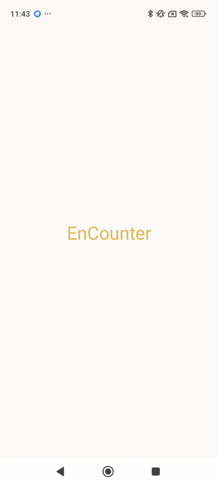
</div>

アプリ起動時の画面。Firebase認証を確認し、自動ログインを実行します。

---

### プロフィール設定

<div align="center">
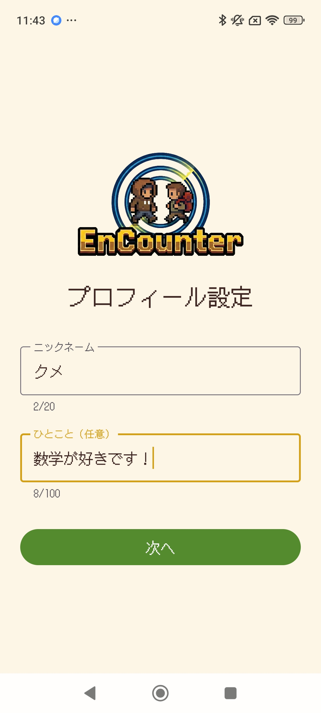
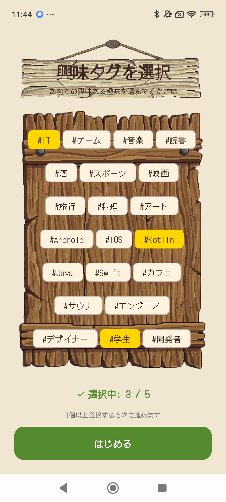
</div>

**左**: プロフィール初期設定 - ニックネームとひとことを入力  
**右**: タグ選択 - 興味のあるタグを複数選択

---

### レーダー画面（メイン）

<div align="center">
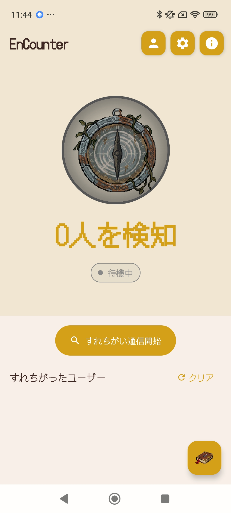
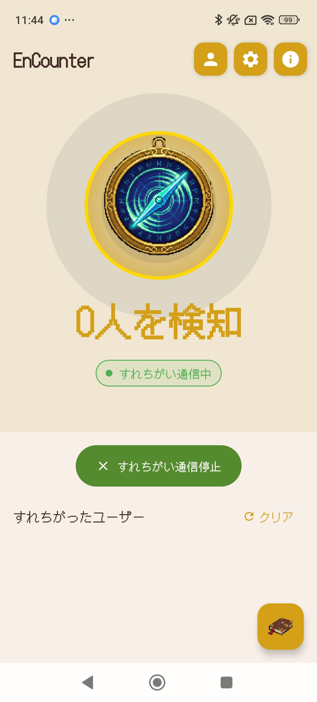
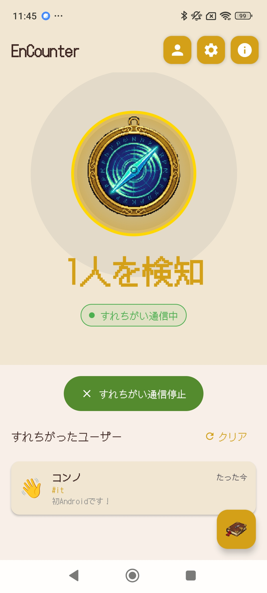
</div>

**左**: すれちがい通信OFF - BLEスキャン停止中  
**中央**: すれちがい通信ON - BLEスキャン中（パルスアニメーション）  
**右**: 検知後 - マッチしたユーザーをリスト表示

---

### すれちがい履歴・ユーザー詳細

<div align="center">
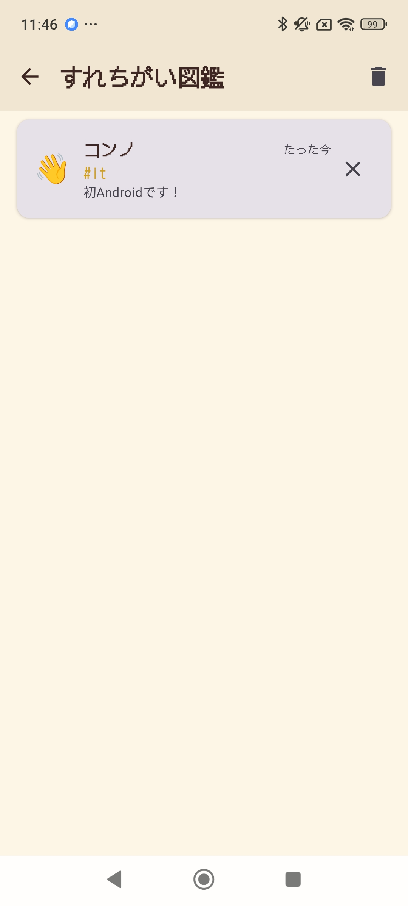
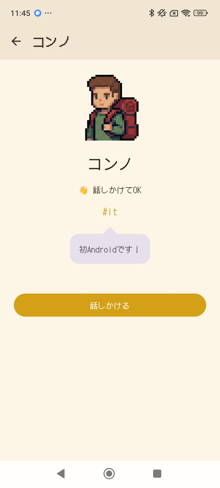
</div>

**左**: すれちがい図鑑 - 過去のすれちがい履歴を時系列で表示  
**右**: ユーザー詳細 - プロフィール閲覧とチャット開始

---

### チャット画面

<div align="center">
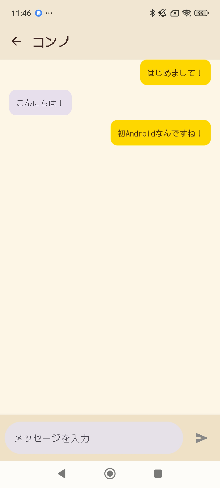
</div>

マッチしたユーザーとのリアルタイムメッセージング。Firebase Firestoreでリアルタイム同期。

---

### 設定・プロフィール編集

<div align="center">
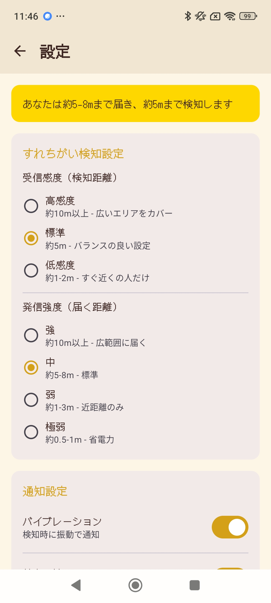
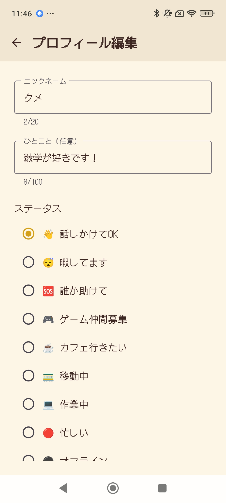
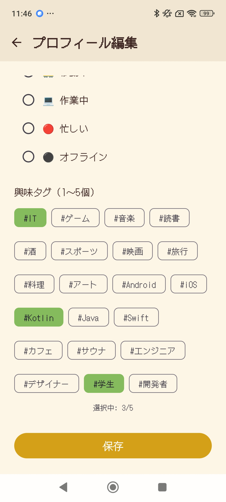
</div>

**左**: 設定画面 - BLE受信感度、通知設定  
**中央**: プロフィール編集 - ニックネーム・ステータス変更  
**右**: 興味タグ編集 - 興味タグの追加・削除

---

### ヘルプ画面

<div align="center">
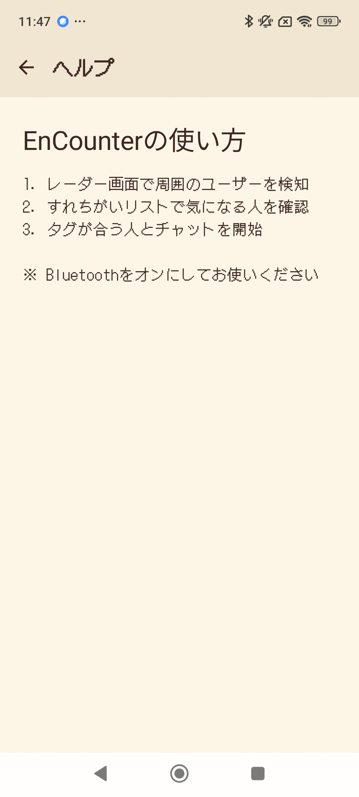
</div>

アプリの使い方とステータスの説明。

---

## 実装例集

### RadarScreen - レーダーアニメーション

```kotlin
@Composable
fun RadarPulseAnimation(isActive: Boolean) {
    val infiniteTransition = rememberInfiniteTransition()
    
    val scale by infiniteTransition.animateFloat(
        initialValue = 1f,
        targetValue = 1.5f,
        animationSpec = infiniteRepeatable(
            animation = tween(1000, easing = LinearEasing),
            repeatMode = RepeatMode.Restart
        )
    )
    
    val alpha by infiniteTransition.animateFloat(
        initialValue = 0.8f,
        targetValue = 0f,
        animationSpec = infiniteRepeatable(
            animation = tween(1000, easing = LinearEasing),
            repeatMode = RepeatMode.Restart
        )
    )
    
    if (isActive) {
        Canvas(modifier = Modifier.fillMaxSize()) {
            drawCircle(
                color = Color.Green.copy(alpha = alpha),
                radius = size.minDimension / 2 * scale,
                style = Stroke(width = 4.dp.toPx())
            )
        }
    }
}
```

### ProfileSetupScreen - フローティングロゴ

```kotlin
@Composable
fun FloatingLogo() {
    val infiniteTransition = rememberInfiniteTransition()
    
    val floatOffset by infiniteTransition.animateFloat(
        initialValue = 0f,
        targetValue = -15f,
        animationSpec = infiniteRepeatable(
            animation = tween(2000, easing = FastOutSlowInEasing),
            repeatMode = RepeatMode.Reverse
        )
    )
    
    Box(modifier = Modifier.offset(y = floatOffset.dp)) {
        Image(
            painter = painterResource(id = R.drawable.logo_encounter),
            contentDescription = "EnCounter Logo",
            modifier = Modifier
                .fillMaxWidth(0.8f)
                .height(150.dp),
            contentScale = ContentScale.Fit
        )
    }
}
```

### UserDetailScreen - RPG吹き出し

```kotlin
@Composable
fun RpgSpeechBubble(text: String) {
    val bubbleColor = MaterialTheme.colorScheme.surfaceVariant
    
    Column(horizontalAlignment = Alignment.CenterHorizontally) {
        // 上向き三角形（しっぽ）
        Canvas(modifier = Modifier.height(12.dp).fillMaxWidth()) {
            val trianglePath = Path().apply {
                moveTo(center.x, 0f)
                lineTo(center.x + 12.dp.toPx(), size.height)
                lineTo(center.x - 12.dp.toPx(), size.height)
                close()
            }
            drawPath(path = trianglePath, color = bubbleColor)
        }
        
        // 本体
        Surface(
            shape = RoundedCornerShape(16.dp),
            color = bubbleColor
        ) {
            Text(
                text = text,
                modifier = Modifier.padding(16.dp)
            )
        }
    }
}
```

### ChatScreen - キーボード追従スクロール

```kotlin
@Composable
fun ChatScreenContent(uiState: ChatUiState) {
    val listState = rememberLazyListState()
    val isImeVisible = WindowInsets.isImeVisible
    var wasAtBottomBeforeIme by remember { mutableStateOf(true) }
    
    // 一番下を見ているかどうか監視
    LaunchedEffect(listState, uiState.messages.size) {
        snapshotFlow {
            val lastVisibleItem = listState.layoutInfo.visibleItemsInfo.lastOrNull()
            lastVisibleItem?.index == listState.layoutInfo.totalItemsCount - 1
        }.collectLatest { isAtBottom ->
            if (!isImeVisible) {
                wasAtBottomBeforeIme = isAtBottom
            }
        }
    }
    
    // キーボードが開いたとき、元々一番下にいた場合のみスクロール
    LaunchedEffect(isImeVisible) {
        if (isImeVisible && wasAtBottomBeforeIme) {
            listState.animateScrollToItem(uiState.messages.lastIndex)
        }
    }
    
    LazyColumn(state = listState) {
        items(uiState.messages) { message ->
            MessageBubble(message)
        }
    }
}
```

---

## 今後の拡張予定

- [ ] RSSI可視化（距離表示）
- [ ] いいね・スタンプ機能
- [ ] すれちがいバッジ・実績システム
- [ ] バックグラウンド動作対応
- [ ] グループマッチング
- [ ] アニメーション改善
- [ ] アクセシビリティ対応

---

## 関連ドキュメント

- [バックエンド・ロジック仕様書](./backend-specification.md)
- [README](../README.md)

---

**変更履歴**:

| 日付 | バージョン | 変更内容 |
|-----|----------|---------|
| 2026-02-06 | 1.0.0 | 初版作成 |
